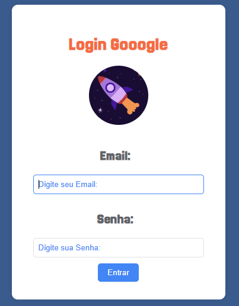

# 🔐 About the Project: google-login
## The google-login project is a login screen created using only HTML and CSS, intended purely for visual presentation and practice. Despite the name, it is not a copy or replica of Google’s official login page. The name simply refers to the idea of a clean and modern login interface.

## The design is entirely non-functional, meaning there is no data validation, database integration, or any kind of backend — the focus is solely on the structure and visual styling.

## The interface includes email and password input fields, a login button, and a clean layout, making it a great exercise in CSS styling and element positioning for front-end development practice.

  

